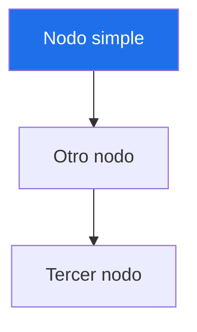
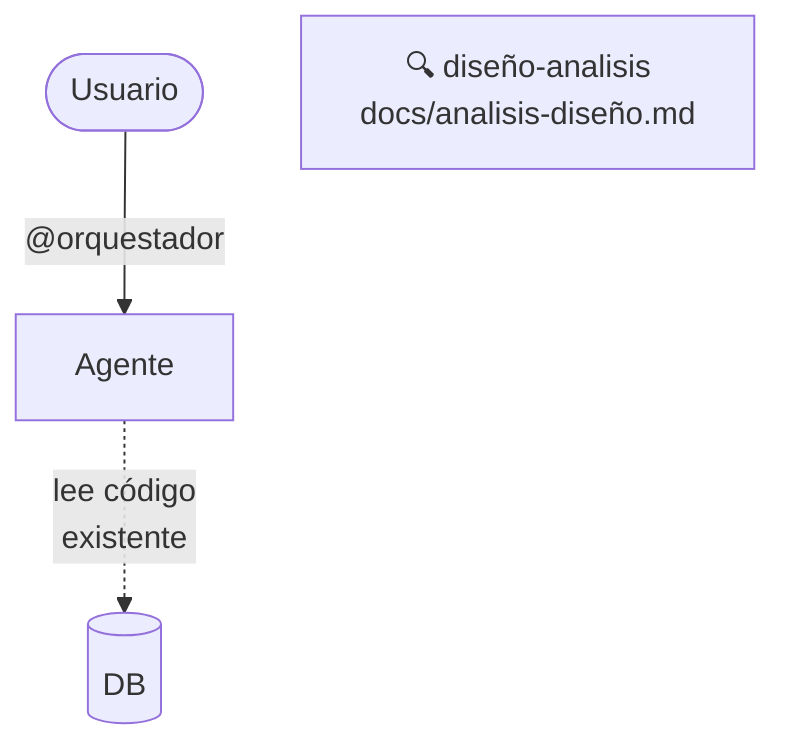
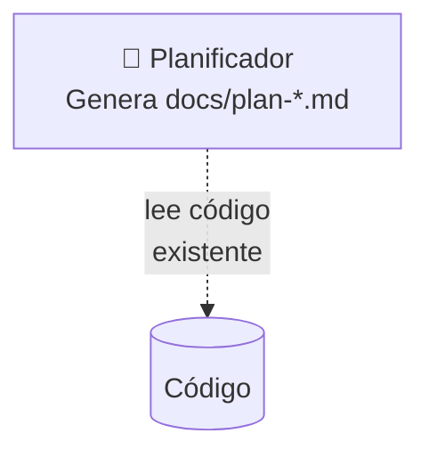
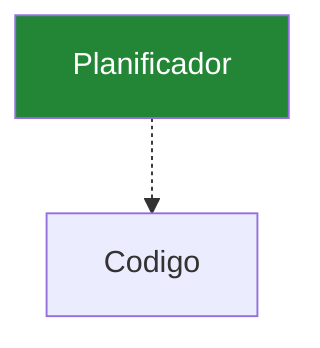

# Actualizador de Documentación Técnica

Mantiene sincronizada la documentación del proyecto con el código fuente real, verificando que los documentos describan fielmente la implementación.

---

## Cuándo ejecutar este skill

### Ejecución obligatoria

- Después de agregar un nuevo agente en `.github/agents/`
- Después de crear o modificar un skill en `.github/skills/`
- Tras cambios en la arquitectura de agentes/skills
- Cuando cambies el flujo de trabajo (planificador → desarrollador → verificador)
- Si modificas las convenciones del proyecto (nombres, estructura de carpetas, patrones)

### Ejecución recomendada

- Antes de una demo o presentación del proyecto
- Al inicio de cada sprint/iteración para validar que la documentación sigue vigente
- Cuando detectes discrepancias entre docs y código
- Tras merge de features grandes que puedan haber desactualizado la documentación

---

## Documentos que mantiene

| Documento | Contenido | Frecuencia |
|-----------|-----------|------------|
| `docs/ARQUITECTURA-AGENTES.md` | Agentes coordinados, flujo de trabajo, herramientas | Cada cambio en `.github/agents/` |
| `docs/skills-orquestacion.md` | Catálogo de skills, dependencias, orden de ejecución | Cada cambio en `.github/skills/` |
| `.github/copilot-instructions.md` | Tabla de skills y agentes disponibles | Cada nuevo skill/agente |
| `README.md` | Descripción general del proyecto | Cambios arquitectónicos mayores |

---

## Proceso de sincronización

### 1. Auditoría de código vs. documentación

**Para agentes:**
```bash
# Listar agentes reales
ls .github/agents/*.agent.md

# Comparar con docs/ARQUITECTURA-AGENTES.md
# Verificar:
# - Nombres de agentes coinciden
# - Descripción de responsabilidades es precisa
# - Flujo de llamadas agent→agent es correcto
# - Herramientas mencionadas existen (read, search, edit, execute)
```

**Para skills:**
```bash
# Listar skills reales
ls .github/skills/*/SKILL.md

# Comparar con docs/skills-orquestacion.md
# Verificar:
# - Todos los skills están documentados
# - Descripciones coinciden con name/description del YAML frontmatter
# - Orden de ejecución refleja las dependencias reales
# - Diagramas muestran el flujo correcto
```

**Para convenciones:**
```bash
# Verificar que .github/copilot-instructions.md liste todos los skills/agentes
# Verificar que las tablas de "Cuándo usarlo" sean precisas
```

### 2. Identificar discrepancias

Documenta cada diferencia encontrada:

| Documento | Línea/Sección | Dice | Debería decir |
|-----------|---------------|------|---------------|
| ... | ... | ... | ... |

### 3. Actualizar documentación

**Prioridad 1: Nombres y estructura**
- Actualizar nombres de agentes/skills si cambiaron
- Corregir rutas de archivos (`.github/agents/` vs `.claude/agents/`)
- Ajustar terminología (GitHub Copilot vs Claude Code)

**Prioridad 2: Flujos y dependencias**
- Corregir secuencias de llamadas entre agentes
- Actualizar orden de ejecución de skills
- Verificar que las dependencias (skill A → skill B) sean correctas

**Prioridad 3: Diagramas Mermaid**
- Regenerar diagramas desactualizados
- Aplicar reglas de sintaxis limpia (ver sección siguiente)

### 4. Validar cambios

- Compilar el proyecto para verificar que no se rompió nada
- Previsualizar Markdown con diagramas Mermaid renderizados
- Leer los documentos actualizados para confirmar coherencia narrativa

---

## Reglas para diagramas Mermaid

### ✅ Sintaxis limpia y compatible



**Permitido:**
- Nodos rectangulares: `[texto]`
- Flechas sólidas: `-->`
- Flechas punteadas: `-.->` (usar con moderación)
- Texto ASCII sin acentos en identificadores: `diseno-analisis`, `logica-negocio`
- Colores en `style`: `fill:#hex,color:#hex`

### ❌ Evitar — causa errores de parseo



**Prohibido:**
- Etiquetas de flechas con texto largo: `-->|"texto largo aquí"|`
- Saltos de línea dentro de nodos: `"línea1\nlínea2"`
- Emojis en etiquetas de nodos (pueden causar problemas de encoding)
- Caracteres especiales en nombres de skills: `diseño` → `diseno`
- Formas complejas con texto multilínea: `([...])`, `[/.../]`
- Código HTML escapado: `&lt;`, `&gt;`, `&amp;`

### 🔧 Cómo simplificar diagramas problemáticos

**Antes (error de parseo):**


**Después (funciona):**


**Estrategia:**
1. Eliminar saltos de línea `\n` de las etiquetas
2. Quitar emojis de las etiquetas de nodos
3. Reemplazar caracteres con tilde: `ó` → `o`, `í` → `i`
4. Remover etiquetas de flechas: `-->|texto|` → `-->`
5. Usar formas simples: `[texto]` en lugar de `([texto])` o `[/texto/]`
6. Si el diagrama sigue fallando, usar nodos planos sin estilos especiales

### 📋 Checklist de validación de diagramas

Antes de commitear un diagrama Mermaid:

- [ ] No hay `\n` en ninguna etiqueta
- [ ] No hay emojis en las etiquetas (pueden estar en comentarios)
- [ ] Todos los caracteres son ASCII básico o sin tilde
- [ ] Las etiquetas de flechas son cortas o inexistentes
- [ ] Previsualizar el Markdown confirma que el diagrama renderiza
- [ ] Si falla, simplificar hasta que funcione — la claridad > estética

---

## Plantilla de commit

Tras actualizar la documentación, usar este mensaje:

```
docs: sincronizar documentación con código actual

- Actualizar [ARQUITECTURA-AGENTES|skills-orquestacion|copilot-instructions]
- Corregir [nombres de agentes|orden de skills|diagramas Mermaid]
- Razón: [nueva feature X|cambio arquitectónico Y|corrección de discrepancias]

[Si aplica: lista de cambios específicos]
```

---

## Ejemplo de ejecución

### Escenario: Se agregó un nuevo agente `@auditor-calidad`

1. **Detectar cambio:**
   ```bash
   # Nuevo archivo detectado
   .github/agents/auditor-calidad.agent.md
   ```

2. **Actualizar `docs/ARQUITECTURA-AGENTES.md`:**
   - Añadir sección describiendo al auditor de calidad
   - Actualizar diagrama de flujo para incluir el nuevo agente
   - Mencionar cuándo invocarlo en el workflow

3. **Actualizar `.github/copilot-instructions.md`:**
   - Añadir entrada en la tabla de agentes:
     ```markdown
     | `@auditor-calidad` | Audita código en busca de code smells, deuda técnica, violaciones SOLID |
     ```

4. **Validar:**
   - Previsualizar ambos archivos
   - Confirmar que los diagramas Mermaid renderizan
   - Verificar que la descripción es precisa

5. **Commit:**
   ```
   docs: añadir auditor-calidad a documentación de agentes
   
   - Actualizar ARQUITECTURA-AGENTES.md con nuevo agente
   - Añadir entrada en copilot-instructions.md
   - Diagrama de flujo incluye ahora auditor-calidad
   ```

---

## Troubleshooting

### "Diagrama Mermaid no renderiza"

1. Copiar el bloque completo `\`\`\`mermaid ... \`\`\``
2. Pegarlo en [Mermaid Live Editor](https://mermaid.live)
3. Si falla allí, el problema es sintaxis Mermaid (no del renderizador)
4. Aplicar reglas de simplificación de la sección anterior
5. Eliminar elementos uno por uno hasta identificar el culpable

### "Documentación actualizada pero sigue sin coincidir"

- Verificar que leíste la última versión del archivo (no copia en caché)
- Confirmar que los cambios se guardaron (`git status`)
- Revisar que no haya otros documentos duplicados en otras carpetas

### "No sé si un skill/agente cambió"

Comparar fecha de modificación:

```bash
# Última modificación de agentes
ls -lt .github/agents/*.agent.md | head -5

# Última modificación de documentación
ls -lt docs/*.md | head -5

# Si la doc es más antigua que los agentes, hay drift
```

---

## Notas importantes

- **La documentación sirve al código, no al revés:** Si el código y la documentación difieren, **el código tiene razón**. Actualiza la documentación para reflejar la realidad.
  
- **Documentación desactualizada es peor que ninguna:** Un documento que miente sobre el sistema genera confusión. Si no puedes mantenerlo actualizado, elimínalo o márcalo como obsoleto.

- **Los diagramas Mermaid deben ser robustos:** Prioriza sintaxis simple y portable sobre estética. Un diagrama que no renderiza no aporta nada.

- **Versionar cambios arquitectónicos:** Cuando un cambio de documentación refleja un cambio arquitectónico mayor (ej. migrar de Claude Code a GitHub Copilot), documentar la razón del cambio en el commit body.

---

## Responsabilidades del skill

### ✅ Este skill SÍ se encarga de:

- Sincronizar nombres de agentes/skills entre código y docs
- Corregir flujos de trabajo desactualizados
- Regenerar/simplificar diagramas Mermaid problemáticos
- Actualizar tablas de "Cuándo usarlo" para skills/agentes
- Mantener coherencia terminológica (ej. GitHub Copilot vs Claude)

### ❌ Este skill NO se encarga de:

- Crear documentación inicial de un proyecto desde cero (usar `diseño-analisis`)
- Escribir tutoriales o guías de usuario (eso es tarea manual)
- Documentar decisiones de negocio o requisitos funcionales
- Generar documentación de API (usar herramientas como Swagger/Scalar)
- Traducir documentación a otros idiomas
