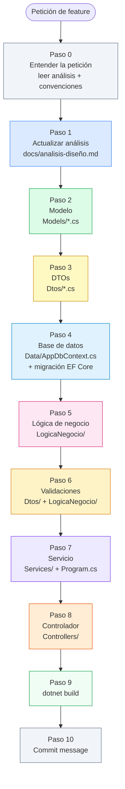

# Skill: Implementar una Feature Completa

## Cuándo usar este skill

- El usuario quiere añadir una **entidad nueva** (p. ej. `UsuarioAsignado`, `Etiqueta`)
- El usuario quiere añadir un **campo nuevo** a una entidad existente (p. ej. `Prioridad` en `TodoItem`)
- El usuario quiere añadir un **endpoint nuevo** que requiere cambios en varias capas
- El usuario pide "implementar X de principio a fin", "hacer todo el proceso para X", "añadir X a la aplicación"
- Cualquier cambio que toque más de dos capas simultáneamente

## Prerequisitos

- `docs/analisis-diseño.md` debe existir. Si no existe, ejecutar primero el skill `diseño-analisis`.
- `.github/copilot-instructions.md` debe existir con las convenciones del proyecto.

---

## Procedimiento

### Paso 0 — Entender la petición

Leer los ficheros de contexto del proyecto antes de hacer nada:

- [`docs/analisis-diseño.md`](../../docs/analisis-diseño.md) — estado actual del modelo y endpoints
- [`.github/copilot-instructions.md`](../copilot-instructions.md) — convenciones del proyecto

Identificar con precisión qué tipo de cambio implica la feature:

| Tipo de cambio | Capas afectadas |
|---|---|
| Nueva entidad con CRUD completo | Todas: análisis → modelo → DTO → BD → lógica → validaciones → servicio → controlador |
| Campo nuevo en entidad existente | Modelo → DTO → BD (migración) → lógica (si afecta reglas) → servicio (mapeo) |
| Endpoint nuevo en entidad existente | Análisis → lógica → servicio → controlador |
| Relación entre entidades (FK) | Modelo → DTO → BD → lógica → servicio |

Si la petición es ambigua, inferir el alcance más probable y continuar — no preguntar.

---

### Paso 1 — Actualizar `docs/analisis-diseño.md`

Es la **fuente de verdad** de todos los skills siguientes. Actualizar antes de tocar código.

#### 1a. Sección 4 — Modelo de datos

Si la feature introduce una entidad nueva, añadirla con todos sus campos, tipos y restricciones.  
Si añade campos a una entidad existente, actualizarlos en la tabla correspondiente.  
Si establece una relación (FK), documentarla explícitamente.

#### 1b. Sección 5 — Endpoints API REST

Si la feature expone endpoints nuevos, añadirlos a la tabla con verbo, ruta, descripción y respuesta esperada.  
Si modifica la respuesta de endpoints existentes (por campos nuevos en el DTO de salida), actualizar su descripción.

Guardar `docs/analisis-diseño.md` antes de continuar al Paso 2.

---

### Paso 2 — Modelo (`Models/`)

Ejecutar el skill [`modelo`](../modelo/SKILL.md):

- Si es entidad nueva: crear `Models/<NuevaEntidad>.cs` con las propiedades y relaciones de navegación.
- Si son campos nuevos: añadirlos a la clase existente respetando las reglas de nullability.
- Seguir todas las reglas del skill `modelo` (namespace, valores por defecto, sin anotaciones de datos, sin lógica).

---

### Paso 3 — DTOs (`Dtos/`)

Ejecutar el skill [`dto`](../dto/SKILL.md):

- Si es entidad nueva: crear `Dtos/<NuevaEntidad>Dtos.cs` con `Crear<Entidad>Dto`, `Actualizar<Entidad>Dto` y `<Entidad>Dto`.
- Si son campos nuevos: añadir los campos a los DTOs existentes de la entidad afectada.
- Nunca exponer propiedades de navegación ni claves foráneas internas en los DTOs de salida; exponer solo los datos que necesita el cliente.

---

### Paso 4 — Base de datos (`Data/`)

Ejecutar el skill [`base-de-datos`](../base-de-datos/SKILL.md):

- Añadir el `DbSet<NuevaEntidad>` a `AppDbContext` si es entidad nueva.
- Configurar la Fluent API: longitudes máximas, campos requeridos, índices únicos, relaciones.
- Generar la migración con un nombre descriptivo en PascalCase (p. ej. `AgregarUsuarioAsignado`, `AgregarPrioridadATodoItem`).

```bash
dotnet ef migrations add <NombreMigración>
dotnet ef database update
```

> Verificar que la migración no borra datos existentes. Si altera una columna existente, asegurarse de que es compatible.

---

### Paso 5 — Lógica de negocio (`LogicaNegocio/`)

Ejecutar el skill [`logica-negocio`](../logica-negocio/SKILL.md):

- Si es entidad nueva: crear `I<Entidad>Logica.cs` y `<Entidad>Logica.cs` con los métodos CRUD básicos.
- Si son operaciones nuevas en entidad existente: añadir los métodos a la interfaz y la implementación existentes.
- Recordar: la lógica trabaja con entidades de dominio, nunca con DTOs.

---

### Paso 6 — Validaciones

Ejecutar el skill [`validaciones`](../validaciones/SKILL.md):

- En los DTOs de entrada (`Crear*Dto`, `Actualizar*Dto`): añadir `[Required]`, `[MaxLength]`, `[Range]` y demás anotaciones según las restricciones definidas en la sección 4 del análisis.
- En la lógica de negocio: añadir comprobaciones de existencia de recursos referenciados (p. ej. si `UsuarioAsignadoId` viene en el DTO, verificar que ese usuario existe antes de guardar).

---

### Paso 7 — Servicio (`Services/`)

Ejecutar el skill [`servicio`](../servicio/SKILL.md):

- Si es entidad nueva: crear `I<Entidad>Service.cs` y `<Entidad>Service.cs`.
- Si son métodos nuevos: añadirlos a la interfaz y la implementación existentes.
- El servicio mapea DTO → entidad (entrada) y entidad → DTO (salida); delega toda operación a la lógica de negocio.
- Registrar **tanto la lógica como el servicio** en `Program.cs`:
  ```csharp
  builder.Services.AddScoped<I<Entidad>Logica, <Entidad>Logica>();
  builder.Services.AddScoped<I<Entidad>Service, <Entidad>Service>();
  ```

---

### Paso 8 — Controlador (`Controllers/`)

Ejecutar el skill [`controlador`](../controlador/SKILL.md):

- Si es entidad nueva: crear `Controllers/<Entidad>sController.cs` con los endpoints definidos en la sección 5.
- Si son endpoints nuevos en entidad existente: añadir los métodos de acción al controlador existente.
- El controlador no contiene lógica de negocio; solo recibe DTOs, llama al servicio y devuelve el resultado HTTP.

---

### Paso 9 — Compilar y verificar

```bash
dotnet build
```

Resolver cualquier error de compilación antes de continuar. Los errores más frecuentes al añadir una feature nueva son:

- Namespace incorrecto en el fichero nuevo.
- `DbSet` o registro en `Program.cs` olvidado (tanto `I<Entidad>Logica` como `I<Entidad>Service` deben tener su `AddScoped`).
- Mapeo incompleto en el servicio (campo nuevo no trasladado de DTO a entidad).
- Migración no generada después de cambiar `AppDbContext`.

---

### Paso 10 — Generar el mensaje de commit

Ejecutar el skill [`commit-message`](../commit-message/SKILL.md) con el resumen de todos los ficheros creados o modificados.

---

## Diagrama de ejecución



---

## Ejemplos de uso

### Ejemplo 1 — Nueva entidad con CRUD

> "Añadir un `UsuarioAsignado` que se puede asignar a una tarea"

Alcance detectado: entidad nueva con relación FK a `TodoItem`.  
Pasos ejecutados: todos (0 → 10).  
Ficheros creados: `Models/UsuarioAsignado.cs`, `Dtos/UsuarioAsignadoDtos.cs`, migración, `LogicaNegocio/IUsuarioAsignadoLogica.cs` + impl., `Services/IUsuarioAsignadoService.cs` + impl., `Controllers/UsuariosAsignadosController.cs`.  
Ficheros modificados: `docs/analisis-diseño.md`, `Data/AppDbContext.cs`, `Models/TodoItem.cs` (propiedad de navegación), `Program.cs`.

### Ejemplo 2 — Campo nuevo en entidad existente

> "Añadir prioridad (Alta / Media / Baja) a las tareas"

Alcance detectado: campo nuevo + enum nuevo.  
Pasos ejecutados: 0, 1, 2 (nuevo enum + campo en `TodoItem`), 3 (campo en DTOs), 4 (migración), 5 (sin cambios en reglas), 6 (validación de rango), 7 (mapeo del campo), 8 (sin cambios en controlador), 9, 10.  
Ficheros creados: `Models/Prioridad.cs` (enum).  
Ficheros modificados: `docs/analisis-diseño.md`, `Models/TodoItem.cs`, `Dtos/TareasDtos.cs`, `Data/AppDbContext.cs`, `LogicaNegocio/TodoLogica.cs`, `Services/TodoService.cs`.

### Ejemplo 3 — Endpoint nuevo sin entidad nueva

> "Endpoint para marcar varias tareas como completadas en una sola petición"

Alcance detectado: operación nueva en entidad existente, sin modelo nuevo.  
Pasos ejecutados: 0, 1 (nuevo endpoint en sección 5), 3 (DTO de entrada para el lote), 5 (método en `ITodoLogica`), 6 (validación del lote), 7 (método en `ITodoService`), 8 (action en `TareasController`), 9, 10.  
Pasos omitidos: 2 (sin cambio de modelo), 4 (sin cambio de DbContext).
