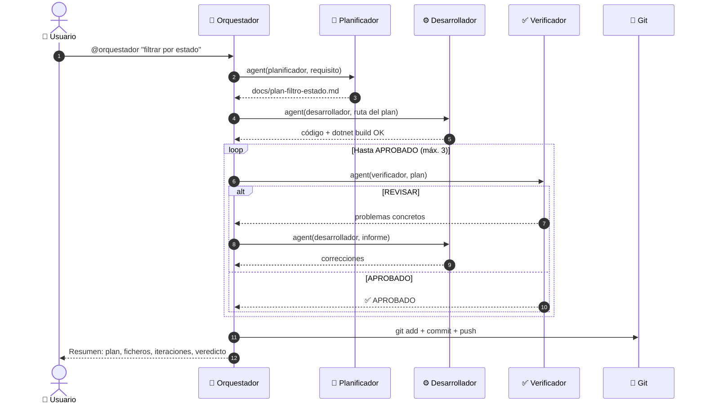
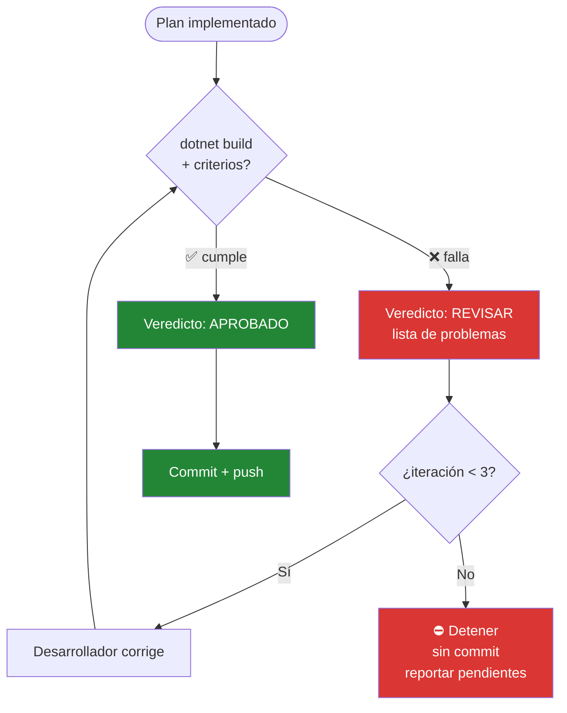
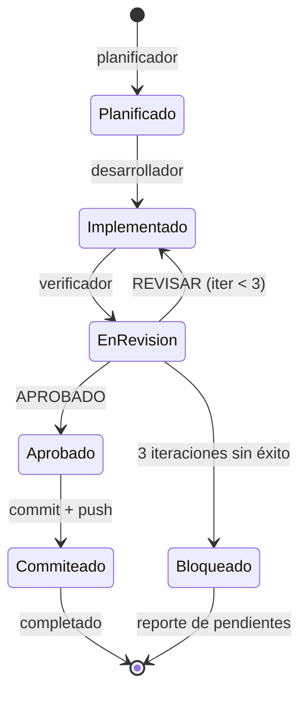
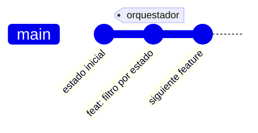
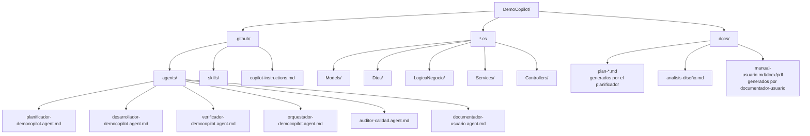

# El equipo de agentes coordinados (en GitHub Copilot)

Ampliar una API a mano tiene un ritmo conocido: piensas qué hay que hacer, lo escribes, compruebas que no has roto nada y lo subes. Cuatro sombreros distintos puestos por la misma persona. Aquí cada sombrero es un agente, y tú solo das la orden de salida con `@orquestador-democopilot`. El resto — el plan, el código, la verificación y el commit — pasa solo.

Este documento cuenta cómo está montado por dentro y por qué se tomó cada decisión.

---

## 1. El mapa, de un vistazo

Tú hablas con uno solo. Ese uno reparte.

```mermaid
flowchart LR
    U([👤 Usuario]) -->|@orquestador funcionalidad| O[🧭 Orquestador<br/>agente coordinador]
    O -->|agent| P[🔎 Planificador<br/>subagente]
    O -->|agent| D[⚙️ Desarrollador<br/>subagente]
    O -->|agent| V[✅ Verificador<br/>subagente]
    O -->|git| GH[(🐙 Git<br/>commit + push)]

    P -.escribe.-> PL[/docs/plan-*.md/]
    D -.edita.-> C[/*.cs/]
    V -.lee + dotnet build.-> C

    classDef orq fill:#1f6feb,color:#fff,stroke:#0b3d91;
    classDef sub fill:#238636,color:#fff,stroke:#0b3d91;
    classDef ext fill:#6e40c9,color:#fff,stroke:#0b3d91;
    class O orq;
    class P,D,V sub;
    class GH ext;
```

El orquestador es el único que toca Git. Los tres especialistas ni se enteran de que se va a hacer commit: lo suyo es leer, planear, escribir código y dar un veredicto. Esa separación es a propósito, y enseguida verás por qué importa.

---

## 2. Quién hace qué

| Rol | Qué es en GitHub Copilot | ¿Toca código? | Herramientas | Lo que deja |
|-----|---------------------|---------------|--------------|------------|
| **Orquestador** | Agente `@orquestador-democopilot` | No | `agent, execute, read, search` | Commit + resumen |
| **Planificador** | Agente `@planificador-democopilot` | Solo el plan `.md` | `read, search, edit` | `docs/plan-<slug>.md` |
| **Desarrollador** | Agente `@desarrollador-democopilot` | Sí | `read, search, edit, execute` | Código que compila |
| **Verificador** | Agente `@verificador-democopilot` | No | `read, search, execute` | Veredicto APROBADO / REVISAR |
| **Auditor de calidad** | Agente `@auditor-calidad` | No | `read, search` | Informe con hallazgos priorizados |
| **Documentador de usuario** | Agente `@documentador-usuario` | No | `read, search, edit, terminal` | Manual de usuario (.md/.docx/.pdf) |

Fíjate en una cosa: el planificador y el verificador **no escriben código de producción**. El planificador solo deja un `.md`; el verificador solo lee y compila. Es la versión software del principio de que quien diseña el examen no debería ser quien lo aprueba. El que verifica no arregla — señala. Y el que arregla es siempre el desarrollador.

---

## 3. El ciclo completo, paso a paso

Esto es lo que ocurre desde que invocas `@orquestador-democopilot` hasta que tienes el código commiteado en main.



El flujo es deliberadamente simple: no crea issues ni PRs automáticamente. El commit va directo a `main` (o la rama en la que estés). La trazabilidad queda en el plan `.md` y en el historial de Git.

### Los 5 pasos en texto (por si el diagrama no te renderiza)

Si tu visor no pinta el diagrama de arriba, aquí tienes lo mismo en plano. Cada paso, con la acción real que ejecuta cada agente:

| # | Paso | Quién | Acción |
|---|------|-------|--------|
| 1 | **Planificar** | Planificador | escribe `docs/plan-<slug>.md` y devuelve su ruta |
| 2 | **Implementar** | Desarrollador | edita el código según el plan + `dotnet build` |
| 3 | **Verificar** | Verificador | `dotnet build` + criterios → `APROBADO` / `REVISAR` (bucle, máx. 3) |
| 4 | **Commit + push** | Orquestador | `git add .` → `git commit -m "feat: …"` → `git push` |
| 5 | **Resumen** | Orquestador | plan, ficheros modificados, iteraciones y veredicto |

La única acción de Git — **commit + push** (paso 4) — la hace siempre el orquestador con `git`. Los subagentes no tocan nada de eso.

---

## 4. El bucle de verificación (donde está la gracia)

Un control de calidad que solo aprueba o suspende sirve de poco. Este devuelve el trabajo con la lista de qué falla, y el desarrollador vuelve a entrar. Hasta tres vueltas.



¿Y por qué tres y no infinitas? Porque un bucle sin tope es la receta para que un malentendido entre el plan y la implementación te queme la tarde dando vueltas. Si tras tres intentos el verificador sigue diciendo REVISAR, el orquestador **para y no hace commit**. Deja el código sin commitear, te cuenta qué quedó pendiente, y decides tú. Mejor un freno honesto que un commit roto con tu nombre.

---

## 5. La vida de una funcionalidad, como estados

Si prefieres verlo como una máquina de estados — de dónde sale, a dónde puede ir cada paso:



Hay dos salidas, no una. La feliz (commiteado y pusheado) y la honesta (bloqueado, con el parte de lo que falta). Las dos son finales válidos.

---

## 6. Lo que pasa en Git

El trabajo se commitea directamente en la rama en la que estés (normalmente `main`). No crea branches automáticamente.



---

## 7. Dónde está cada cosa



Todo vive en `.github/` — agentes, skills y convenciones. El orquestador y los especialistas están en `.github/agents/`.

---

## 8. Nombres y herramientas

Los agentes de GitHub Copilot tienen nombres completos y herramientas específicas:

| Agente | Nombre completo | Herramientas |
|--------|----------------|-------------|
| **Orquestador** | `@orquestador-democopilot` | `agent`, `execute`, `read`, `search` |
| **Planificador** | `@planificador-democopilot` | `read`, `search`, `edit` |
| **Desarrollador** | `@desarrollador-democopilot` | `read`, `search`, `edit`, `execute` |
| **Verificador** | `@verificador-democopilot` | `read`, `search`, `execute` |
| **Auditor de calidad** | `@auditor-calidad` | `read`, `search` |
| **Documentador de usuario** | `@documentador-usuario` | `read`, `search`, `edit`, `terminal` |

Todas las convenciones del proyecto están en `.github/copilot-instructions.md`, que GitHub Copilot carga automáticamente.

---

## 9. Cómo se usa

Dos cosas tienen que estar en su sitio antes de empezar: el **SDK de .NET 10** (compruébalo con `dotnet --version`) y **GitHub Copilot** habilitado en VS Code.

Con eso, lanzar el ciclo entero es una línea:

```text
@orquestador-democopilot filtrar tareas por estado (completadas / pendientes)
```

Y a partir de ahí no tienes que tocar nada: plan, código, verificación y commit. Al final te queda el resumen con los ficheros modificados y el veredicto.

¿Quieres usar un agente suelto, sin todo el ciclo? También vale:

```text
@planificador-democopilot planea la paginación de /tareas
@desarrollador-democopilot implementa docs/plan-paginacion.md
@verificador-democopilot verifica docs/plan-paginacion.md
```

> Un aviso que ahorra disgustos: los agentes se cargan **al arrancar VS Code**. Si acabas de crear o modificar un `.agent.md`, reinicia VS Code o no aparecerán.

---

## 10. Cuando algo no va

| Lo que ves | Lo que suele ser | Qué hacer |
|---|---|---|
| `@orquestador-democopilot` no aparece | Arrancaste VS Code antes de crear el agente | Reinicia VS Code |
| «No encuentro el agente» | El `name` del frontmatter no coincide con la invocación | Tiene que ser exactamente `orquestador-democopilot` / `planificador-democopilot` / etc. |
| No se hace commit | El verificador nunca llegó a APROBADO (3 iteraciones) | Mira los problemas que reportó, corrígelos manualmente |
| El build peta | Error de compilación en el código generado | Lee el error, pasa el mensaje al desarrollador para que corrija |
| Git rechaza el push | No tienes permisos o la rama está protegida | Verifica tus credenciales y permisos del repo |

Y si nada de esto encaja con tu síntoma, el primer movimiento casi siempre es el mismo: reinicia VS Code y vuelve a probar con un requisito pequeño. La mitad de los problemas de configuración se evaporan ahí.
