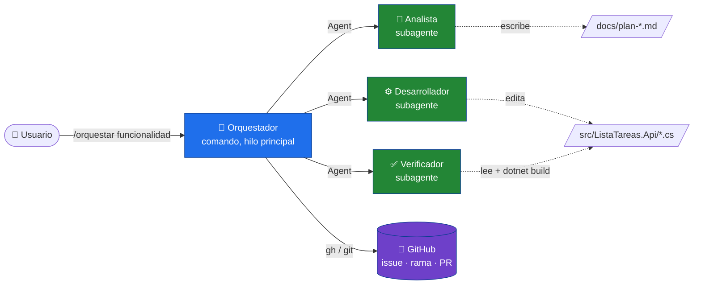
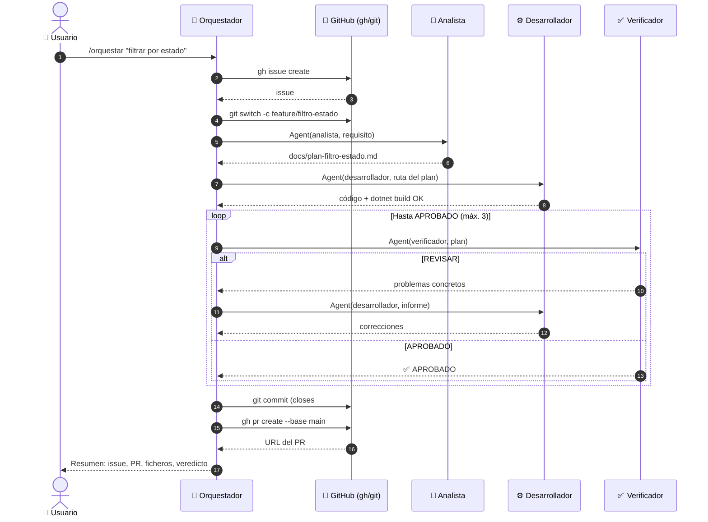
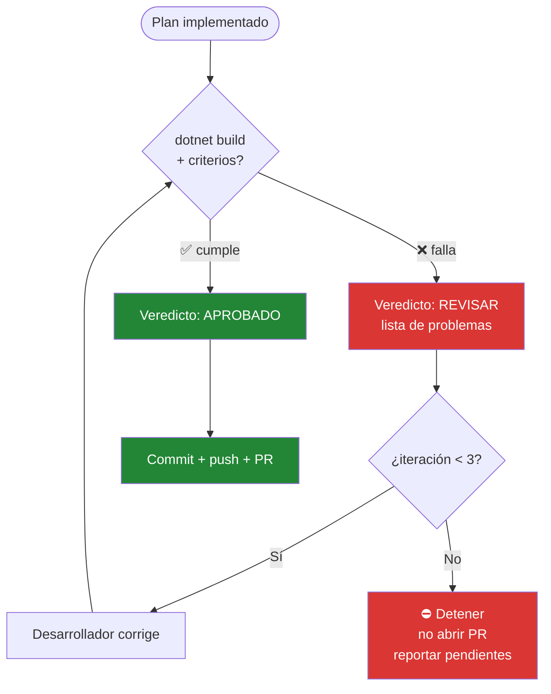
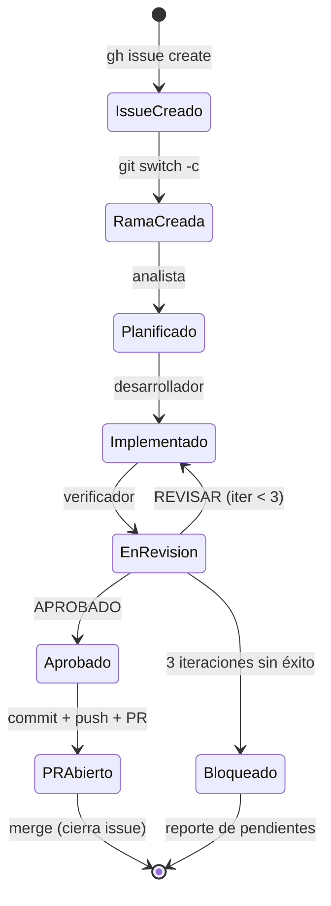
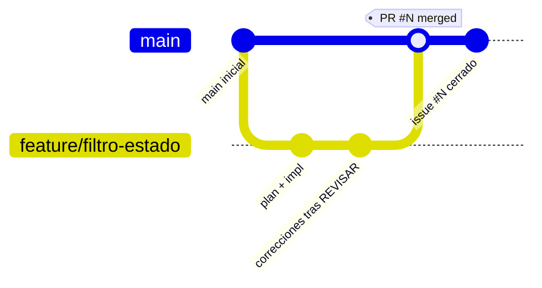
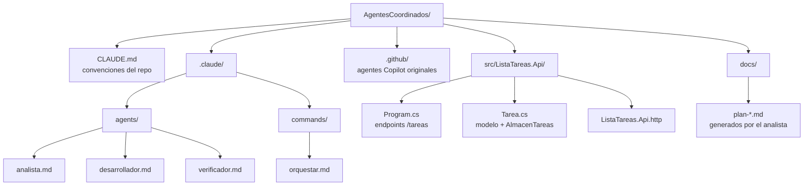

# El equipo de agentes coordinados (en Claude Code)

Ampliar una API a mano tiene un ritmo conocido: piensas qué hay que hacer, lo escribes, compruebas que no has roto nada y lo subes. Cuatro sombreros distintos puestos por la misma persona. Aquí cada sombrero es un agente, y tú solo das la orden de salida con `/orquestar`. El resto — el issue, la rama, el plan, el código, la verificación y el Pull Request — pasa solo.

Este documento cuenta cómo está montado por dentro y por qué se tomó cada decisión.

> ¿Vienes de la versión con GitHub Copilot? Está en [`../MANUAL.md`](../MANUAL.md). Esto es la adaptación a **Claude Code**, que no es un copia-pega — hay una diferencia de arquitectura que lo cambia todo, y la cuento en la sección 2.

---

## 1. El mapa, de un vistazo

Tú hablas con uno solo. Ese uno reparte.



El orquestador es el único que toca GitHub. Los tres especialistas ni se enteran de que existe un issue o un PR: lo suyo es leer, planear, escribir código y dar un veredicto. Esa separación es a propósito, y enseguida verás por qué importa.

---

## 2. Por qué el orquestador NO es un subagente

Aquí está la trampa, y es la duda que tendrías al venir de Copilot: «si en Copilot el orquestador era un agente que llamaba a otros agentes, ¿por qué aquí no?».

Porque en Claude Code los subagentes corren aislados. Cada uno tiene su propia ventana de contexto, hace su tarea y devuelve un resultado — pero **no puede invocar a otro subagente**. Es como un especialista metido en una sala insonorizada: trabaja de maravilla, pero no puede llamar por teléfono a la sala de al lado.

¿Quién sí puede llamar a las salas? El hilo principal. El que tiene el teléfono.

Por eso el orquestador no es un subagente más, sino un **comando** (`/orquestar`) que se ejecuta en ese hilo principal. Desde ahí sí tiene la herramienta `Agent` para ir llamando al analista, al desarrollador y al verificador uno tras otro. Si lo hubiéramos dejado como subagente, se quedaría mirando el techo de su sala insonorizada sin poder coordinar a nadie.

La consecuencia práctica es la tabla de la sección siguiente: el coordinador gestiona git y GitHub; los especialistas solo tocan su parcela.

---

## 3. Quién hace qué

| Rol | Qué es en Claude Code | ¿Toca código? | Herramientas | Lo que deja |
|-----|---------------------|---------------|--------------|------------|
| **Orquestador** | Comando `/orquestar` | No | `Agent, Bash, Read, Grep, Glob` | Issue + PR + resumen |
| **Analista** | Subagente | Solo el plan `.md` | `Read, Grep, Glob, Write, Edit` | `docs/plan-<slug>.md` |
| **Desarrollador** | Subagente | Sí | `Read, Grep, Glob, Write, Edit, Bash` | Código que compila |
| **Verificador** | Subagente | No | `Read, Grep, Glob, Bash` | Veredicto APROBADO / REVISAR |

Fíjate en una cosa: el analista y el verificador **no escriben código de producción**. El analista solo deja un `.md`; el verificador solo lee y compila. Es la versión software del principio de que quien diseña el examen no debería ser quien lo aprueba. El que verifica no arregla — señala. Y el que arregla es siempre el desarrollador.

---

## 4. El ciclo completo, paso a paso

Esto es lo que ocurre desde que escribes `/orquestar` hasta que tienes un PR esperando revisión. Incluye GitHub de punta a punta.



El detalle que más se agradece: el commit lleva `closes #N`. Eso significa que cuando alguien fusione el PR, GitHub cierra el issue solo. No tienes que acordarte de nada. La trazabilidad — qué se pidió, qué se planeó, qué se cambió — queda cosida sin esfuerzo.

### Los 8 pasos en texto (por si el diagrama no te renderiza)

Si tu visor no pinta el diagrama de arriba, aquí tienes lo mismo en plano. Cada paso, con el comando real que lanza el orquestador:

| # | Paso | Quién | Comando / acción |
|---|------|-------|------------------|
| 1 | **Crear el issue** | Orquestador | `gh issue create --title … --body …` → guarda el `#N` |
| 2 | **Crear la rama** | Orquestador | `git switch main` → `git pull --ff-only` → `git switch -c feature/<slug>` |
| 3 | **Planificar** | Analista | escribe `docs/plan-<slug>.md` y devuelve su ruta |
| 4 | **Implementar** | Desarrollador | edita el código según el plan + `dotnet build` |
| 5 | **Verificar** | Verificador | `dotnet build` + criterios → `APROBADO` / `REVISAR` (bucle, máx. 3) |
| 6 | **Commit + push** | Orquestador | `git commit -m "feat: … (closes #N)"` → `git push -u origin feature/<slug>` |
| 7 | **Abrir el PR** | Orquestador | `gh pr create --base main --head feature/<slug> --body "Closes #N …"` |
| 8 | **Resumen** | Orquestador | enlaces del **issue** y del **PR**, ficheros y veredicto |

Las tres acciones de GitHub — **issue** (paso 1), **rama** (paso 2) y **Pull Request** (paso 7) — las hace siempre el orquestador con `gh`/`git`. Los subagentes no tocan nada de eso.

> **Ejemplo real ya ejecutado:** issue [#1](https://github.com/hispafox/AgentesCoordinados/issues/1) → rama `feature/filtro-estado` → PR [#2](https://github.com/hispafox/AgentesCoordinados/pull/2).

---

## 5. El bucle de verificación (donde está la gracia)

Un control de calidad que solo aprueba o suspende sirve de poco. Este devuelve el trabajo con la lista de qué falla, y el desarrollador vuelve a entrar. Hasta tres vueltas.



¿Y por qué tres y no infinitas? Porque un bucle sin tope es la receta para que un malentendido entre el plan y la implementación te queme la tarde dando vueltas. Si tras tres intentos el verificador sigue diciendo REVISAR, el orquestador **para y no abre el PR**. Deja la rama y el issue como están, te cuenta qué quedó pendiente, y decides tú. Mejor un freno honesto que un Pull Request roto con tu nombre.

---

## 6. La vida de una funcionalidad, como estados

Si prefieres verlo como una máquina de estados — de dónde sale, a dónde puede ir cada paso:



Hay dos salidas, no una. La feliz (PR fusionado, issue cerrado) y la honesta (bloqueado, con el parte de lo que falta). Las dos son finales válidos.

---

## 7. Lo que pasa en Git

Todo el trabajo vive en una rama `feature/<slug>`. `main` no se toca hasta que el PR se fusiona.



---

## 8. Dónde está cada cosa



Los agentes de Copilot siguen en `.github/agents/` intactos. No estorban — sirven para Copilot. Esto es la versión paralela para Claude Code, no un reemplazo.

---

## 9. De Copilot a Claude Code: el diccionario

La adaptación es sobre todo dos cosas: traducir el vocabulario de herramientas y mover el orquestador de subagente a comando (lo de la sección 2).

| Concepto en Copilot (`.github/agents/`) | Equivalente en Claude Code | Nota |
|---|---|---|
| `orquestador.agent.md` (tool `agent` + `agents:`) | `/orquestar` (comando) | Un subagente no puede coordinar a otros → al hilo principal |
| `analista.agent.md` | `.claude/agents/analista.md` | Subagente |
| `desarrollador.agent.md` | `.claude/agents/desarrollador.md` | Subagente |
| `verificador.agent.md` | `.claude/agents/verificador.md` | Subagente |
| `copilot-instructions.md` | `CLAUDE.md` | Contexto compartido por todos |
| tool `read` | `Read` | |
| tool `search` | `Grep`, `Glob` | |
| tool `edit` | `Write`, `Edit` | |
| tool `execute` | `Bash` | `dotnet build`, `git`, `gh` |
| tool `agent` | `Agent` | Solo en el hilo principal / comando |

---

## 10. Cómo se usa

Tres cosas tienen que estar en su sitio antes de empezar: el **SDK de .NET 10** (compruébalo con `dotnet --version`), el **GitHub CLI** autenticado (`gh auth status`), y Claude Code abierto en la **raíz** del repo — esa que contiene la carpeta `.claude/`. Si abres una subcarpeta, no encontrará ni el comando ni los subagentes.

Con eso, lanzar el ciclo entero es una línea:

```text
/orquestar filtrar tareas por estado (completadas / pendientes)
```

Y a partir de ahí no tienes que tocar nada: issue, rama, plan, código, verificación, commit y PR. Al final te quedan los dos enlaces que importan — el del issue y el del PR.

¿Quieres usar un rol suelto, sin todo el ciclo? También vale. Pídelo en cristiano: *«usa el subagente analista para planear la paginación de `/tareas`»*. Claude tirará solo de ese.

> Un aviso que ahorra disgustos: los subagentes y comandos se cargan **al arrancar Claude Code**. Si acabas de crearlos o tocarlos, reinicia la sesión o no aparecerán.

---

## 11. Cuando algo no va

| Lo que ves | Lo que suele ser | Qué hacer |
|---|---|---|
| `/orquestar` no aparece | Arrancaste la sesión antes de crear el comando | Reinicia Claude Code |
| «No encuentro el subagente» | El `name` del frontmatter no coincide | Tiene que ser exactamente `analista` / `desarrollador` / `verificador` |
| `gh: command not found` | GitHub CLI sin instalar o fuera del PATH | `winget install GitHub.cli` y abre una terminal nueva |
| No se crea el PR | El verificador nunca llegó a APROBADO | Mira los problemas que reportó, corrígelos y reintenta |
| El build peta por OpenApi | La versión del paquete no casa con tu SDK | Ajusta `Microsoft.AspNetCore.OpenApi` en el `.csproj` |

Y si nada de esto encaja con tu síntoma, el primer movimiento casi siempre es el mismo: reinicia la sesión y vuelve a probar con un requisito pequeño. La mitad de los problemas de configuración se evaporan ahí.
