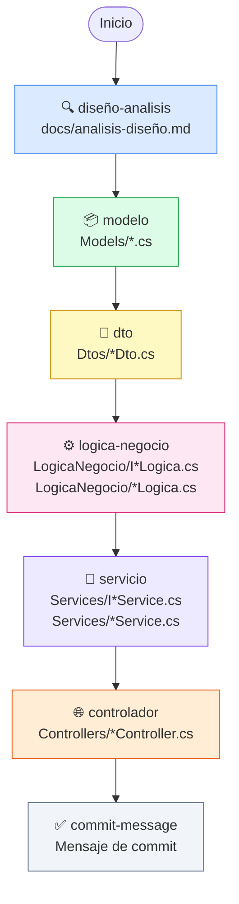
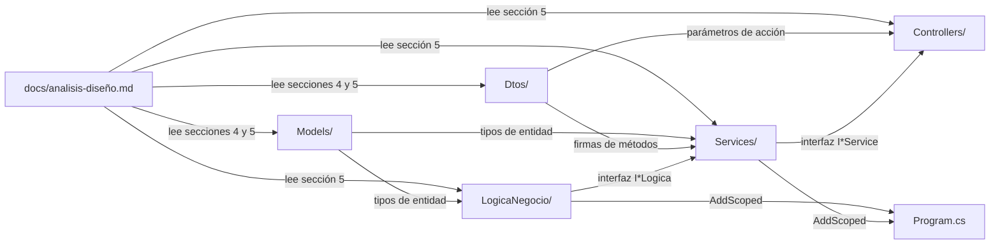
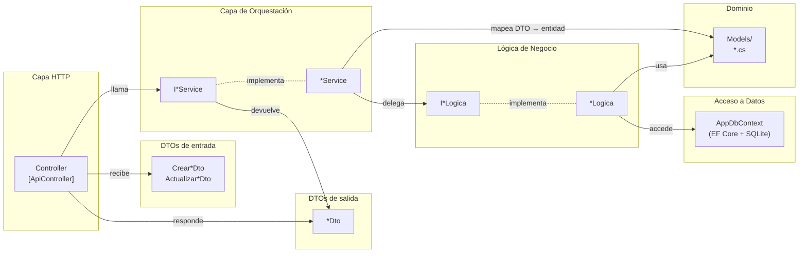
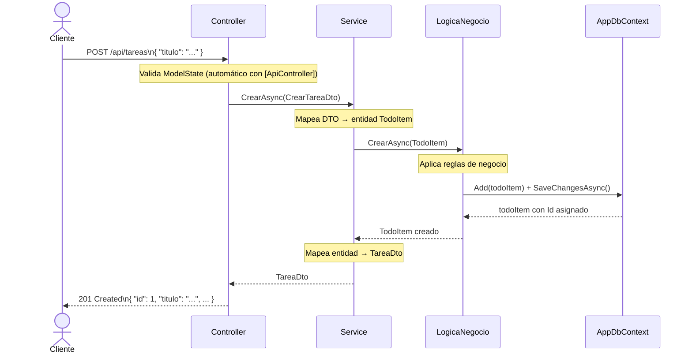
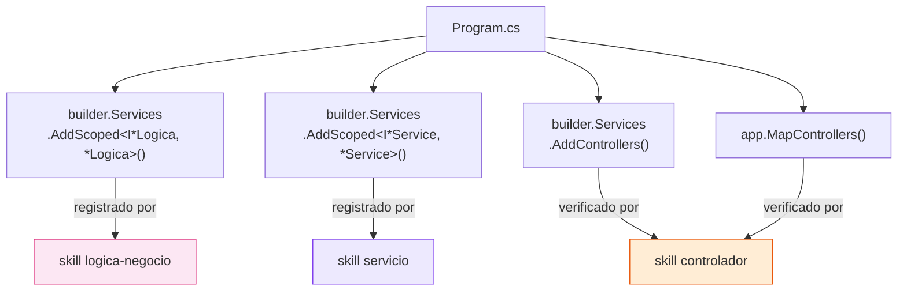

# Orquestación de Skills — DemoCopilot

Este documento describe el conjunto de skills disponibles en el proyecto, su propósito, las dependencias entre ellos y cómo se coordinan para construir la aplicación de forma incremental.

---

## 1. Catálogo de skills

| Skill | Carpeta generada | Responsabilidad |
|---|---|---|
| `diseño-analisis` | `docs/` | Documento de análisis y diseño — fuente de verdad de todo lo demás |
| `modelo` | `Models/` | Entidades de dominio (clases C#) |
| `dto` | `Dtos/` | Contratos de entrada y salida de la API |
| `logica-negocio` | `LogicaNegocio/` | Reglas de negocio + acceso a `DbContext` |
| `servicio` | `Services/` | Orquestación: mapeo DTO ↔ entidad, delegación a lógica |
| `controlador` | `Controllers/` | Capa HTTP: recibe peticiones, llama al servicio, devuelve respuesta |
| `commit-message` | — | Genera el mensaje de commit siguiendo convenciones del proyecto |

---

## 2. Flujo de ejecución — orden obligatorio

Los skills tienen dependencias estrictas. El diagrama muestra el orden en que deben ejecutarse y qué artefacto produce cada uno:

---

## 3. Dependencias entre skills

Cada skill lee los artefactos de los skills anteriores como fuente de verdad. Nunca infiere ni inventa — si el prerequisito no existe, detiene la ejecución.

---

## 4. Arquitectura de capas generada

Una vez ejecutados todos los skills, la aplicación queda estructurada en capas con responsabilidades claramente separadas:

---

## 5. Flujo de una petición en runtime

Cómo viajan los datos desde el cliente HTTP hasta la base de datos y de vuelta:

---

## 6. Gestión de `Program.cs`

Cada skill que genera clases registrables actualiza `Program.cs` con los registros de inyección de dependencias. El resultado final queda así:

---

## 7. Cuándo usar cada skill

```mermaid
flowchart TD
    START([Nueva feature / nuevo recurso]) --> Q1{¿Existe\ndocs/analisis-diseño.md?}

    Q1 -->|No| DA["▶ Ejecutar\ndiseño-analisis"]
    Q1 -->|Sí| Q2{¿Existen\nlos modelos?}

    DA --> Q2

    Q2 -->|No| MO["▶ Ejecutar\nmodelo"]
    Q2 -->|Sí| Q3{¿Existen\nlos DTOs?}

    MO --> Q3

    Q3 -->|No| DTO["▶ Ejecutar\ndto"]
    Q3 -->|Sí| Q4{¿Existe\nlógica de negocio?}

    DTO --> Q4

    Q4 -->|No| LN["▶ Ejecutar\nlogica-negocio"]
    Q4 -->|Sí| Q5{¿Existen\nlos servicios?}

    LN --> Q5

    Q5 -->|No| SV["▶ Ejecutar\nservicio"]
    Q5 -->|Sí| Q6{¿Existen\nlos controladores?}

    SV --> Q6

    Q6 -->|No| CT["▶ Ejecutar\ncontrolador"]
    Q6 -->|Sí| CM["▶ Ejecutar\ncommit-message"]

    CT --> CM
    CM --> END([Listo para commit])

    style DA  fill:#dbeafe,stroke:#3b82f6
    style MO  fill:#dcfce7,stroke:#16a34a
    style DTO fill:#fef9c3,stroke:#ca8a04
    style LN  fill:#fce7f3,stroke:#db2777
    style SV  fill:#ede9fe,stroke:#7c3aed
    style CT  fill:#ffedd5,stroke:#ea580c
    style CM  fill:#f1f5f9,stroke:#64748b
```

---

## 8. Convenciones de nomenclatura por capa

| Capa | Interfaz | Implementación | Ejemplo |
|---|---|---|---|
| Lógica de negocio | `I<Recurso>Logica` | `<Recurso>Logica` | `ITareaLogica` / `TareaLogica` |
| Servicio | `I<Recurso>Service` | `<Recurso>Service` | `ITareaService` / `TareaService` |
| Controlador | — | `<Recurso>Controller` | `TareasController` |
| DTO entrada crear | — | `Crear<Recurso>Dto` | `CrearTareaDto` |
| DTO entrada actualizar | — | `Actualizar<Recurso>Dto` | `ActualizarTareaDto` |
| DTO salida | — | `<Recurso>Dto` | `TareaDto` |
| Entidad de dominio | — | `<Recurso>` | `TodoItem` |
